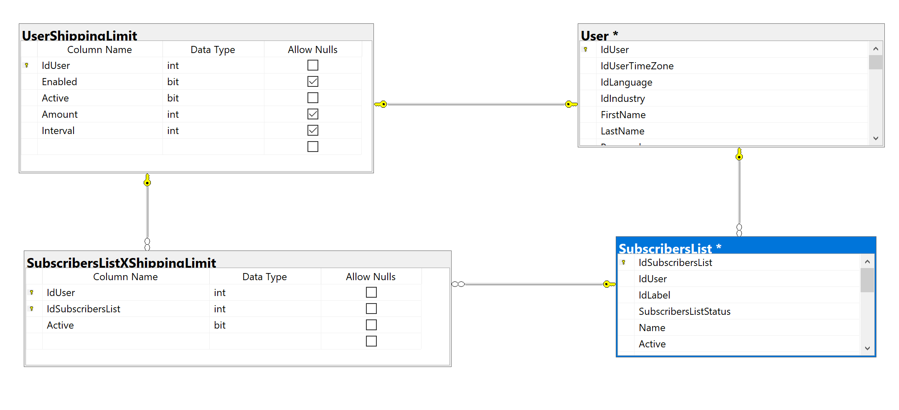

# Detalles de implementación de Contact Policies

## Base de datos

### Tabla `UserShippingLimit`

Contiene la configuración básica de políticas de contacto. Si no existe o `UserShippingLimit.Active = 0` se considera que está desactivado.

**Campo `UserShippingLimit.Amount`:** Define la cantidad de emails a enviar en el período de tiempo.

**Campo `UserShippingLimit.Interval`:** Define el período de tempo medido en días.

Por el momento, si se intenta editar las políticas de contacto y la fila `UserShippingLimit` relacionada al usuario no existe, se podría manejar como un error.

### Tabla `SubscribersListXShippingLimit`

Contiene las listas seleccionadas para excluir del límite de envíos (el nombre no es muy descriptivo)

Cuando se asocia una lista, se crea la fila correspondiente con los IDs correspondientes a la relación y la columna `SubscribersListXShippingLimit.Active = 1`.

Cuando se desasocia una lista, se elimina la fila.

## Permisos

Si bien en la documentación se habla de _Usuarios Free_, _Usuarios Pagos_ y _Usuarios Plus_, en realidad el comportamiento se basará en flags más granulares devueltos por el nuevo servicio [Doppler Users API](https://github.com/FromDoppler/doppler-users-api) en base al token JWT del usuario.

Determinado flag indicará que el usuario no tiene disponible la funcionalidad, otro que tiene la funcionalidad básica y otro que tiene la funcionalidad avanzada.

A continuación se detallan algunos escenarios a modo de ejemplo y aclaratorio, los detalles del comportamiento se encuentran en el documento [Políticas de Contacto V2](https://makingsense.atlassian.net/wiki/spaces/DOP/pages/704249857/Pol+ticas+de+Contacto+V2).

### Promo de política de contacto (funcionalidad no disponible)

[Ver mockup](https://www.figma.com/file/YjtGdoOSCoo4UTTtGxZowV/Pol%C3%ADtica-de-Contacto?node-id=356%3A264)

Actualmente:

- cuando no existe la fila `UserShippingLimit`
- o cuando `UserShippingLimit.Enabled = 0`
- o cuando `UserShippingLimit.Enabled IS NULL`

**Pero mejor:** vamos a utilizar la respuesta del nuevo servicio [Doppler Users API](https://github.com/FromDoppler/doppler-users-api), que ya va a indicar si el usuario tiene la funcionalidad disponible y con que nivel.

### Política de contacto desactivada

[Ver mockup](https://www.figma.com/file/YjtGdoOSCoo4UTTtGxZowV/Pol%C3%ADtica-de-Contacto?node-id=205%3A4080)

Cuando:

- tiene permisos (Ver [Doppler Users API](https://github.com/FromDoppler/doppler-users-api)) y:
  - cuando no existe la fila `UserShippingLimit`
  - o cuando `UserShippingLimit.Active = 0`

### Política de contacto activada (para usuario pago No-Plus)

[Ver mockup](https://www.figma.com/file/YjtGdoOSCoo4UTTtGxZowV/Pol%C3%ADtica-de-Contacto?node-id=157%3A3660)

Cuando:

- tiene permisos (Ver [Doppler Users API](https://github.com/FromDoppler/doppler-users-api))
- y no tiene permisos de funcionalidades avanzadas (plus) (Ver [Doppler Users API](https://github.com/FromDoppler/doppler-users-api)) **NO EXISTE AÚN**
- y existe la fila `UserShippingLimit`
- y `UserShippingLimit.Active = 1`

### Política de contacto activada (para Plus)

[Ver mockup](https://www.figma.com/file/YjtGdoOSCoo4UTTtGxZowV/Pol%C3%ADtica-de-Contacto?node-id=42%3A3172)

Cuando:

- tiene permisos (Ver [Doppler Users API](https://github.com/FromDoppler/doppler-users-api))
- y tiene permisos de funcionalidades avanzadas (plus) (Ver [Doppler Users API](https://github.com/FromDoppler/doppler-users-api)) **NO EXISTE AÚN**
- y existe la fila `UserShippingLimit`
- y `UserShippingLimit.Active = 1`
